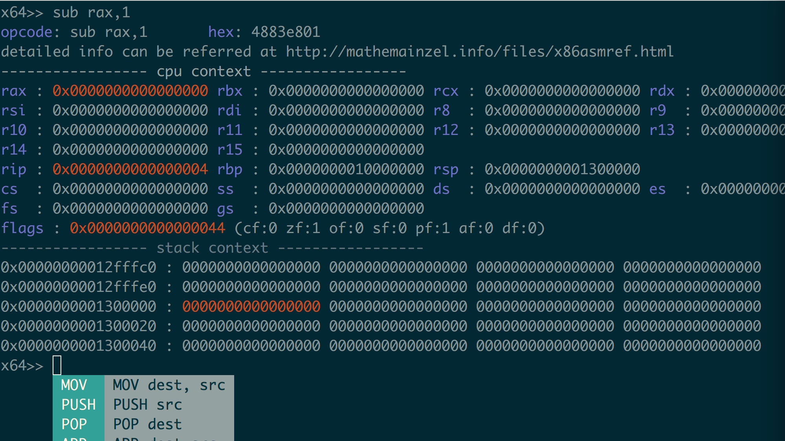
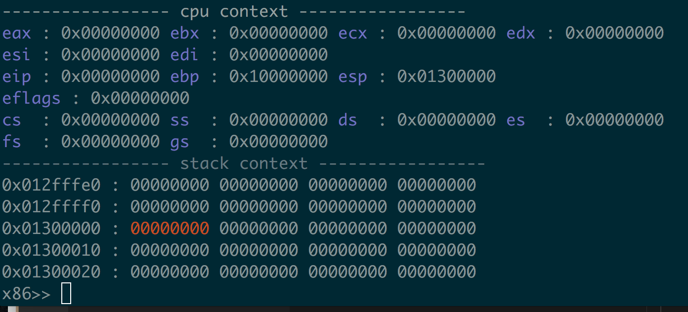

Overview
----------------
ASM shell based on unicorn

Currently only support x86 and x64 arch,

Because rasm2 only support 32/64 bits opcode to machine code conversion

Releases
---------------
https://github.com/cch123/asm-cli/releases

Snapshots
----------------
X64 mode :

X86 mode :

Dependency
----------------
1. rasm2 in radare2
2. unicorn-engine/unicorn
3. golang (https://golang.org/doc/install)
3. that's all!

Build From Source
----------------
1. install radare2
2. install unicorn (https://github.com/unicorn-engine/unicorn)
3. install golang (https://golang.org/doc/install)
4. build this project

Build
----------------
1. go get -u github.com/c-bata/go-prompt
2. go get -u github.com/unicorn-engine/unicorn/bindings/go/unicorn
3. cd $GOROOT/
4. go build \*.go

Run
----------------
./8086 -a x86   #32bit mode
./8086 -a x64   #64bit mode (default, even on x86)
